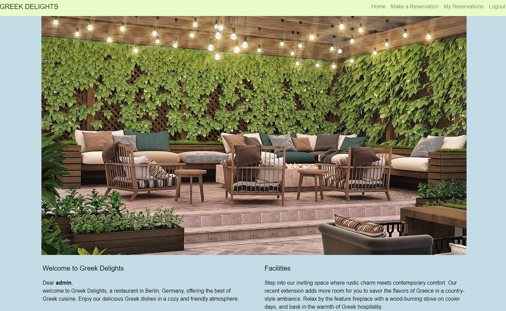
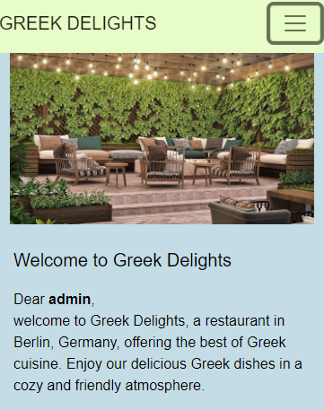
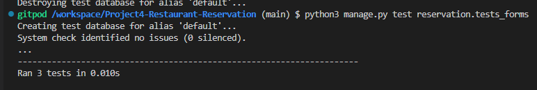
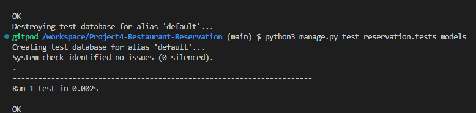
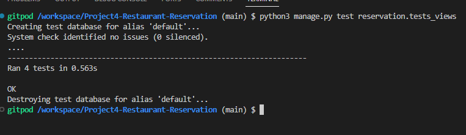

# Restaurant Reservation Django Project

## 1. About The Project

This Django project is designed to manage restaurant reservations. It allows users to create reservations with their full name, email, mobile number, date, time, number of guests, and special requirements. The status of each reservation can be updated by admins in the admin panel. Users can also view their upcoming reservations and cancel or amend them if necessary.

## 2. Built With

- Django
- Cloudinary
- GitPod
- GitHub
- HTML
- CSS
- JavaScript
- Bootstrap
- POSTGRES

## 3. Usage

1. Users can sign up and log in to the system.
2. Users can make new reservations by providing the required details.
3. Users can view their upcoming reservations and cancel or amend them if needed.
4. Admins can manage reservations in the admin panel.

## 4. User Stories

1. As a restaurant customer, I want to be able to create a reservation with my contact details, preferred date, time, and the number of guests attending so that I can secure a table for my visit.
2. As a restaurant customer, I want to view my upcoming reservations and have the ability to cancel or amend them in case of any changes in my plans.
3. As a restaurant administrator, I want to see a list of all reservations and be able to update their status (pending, accepted, declined) to manage the restaurant's capacity efficiently.
4. As a restaurant administrator, I want to be able to manage user accounts, including creating new admin accounts and resetting passwords, to ensure the security and integrity of the reservation system.

## 5. Features

* Reservation Form: The application provides a reservation form where users can input their details, such as name, contact information, date, time, special requests, and the number of guests, to make a reservation at the restaurant.
* Unique Constraint: The application enforces a unique constraint to ensure that a user cannot make multiple reservations with the same date and time.
* Reservation List: The application offers a dedicated page for logged-in users to view their upcoming reservations, sorted by date in descending order.
* Automated Testing: The application includes automated tests to verify the functionality of the reservation form, the reservation model's unique constraint, and the reservation views.

## Database Schema

1. Reservation Table:

| Field       | Type           | Constraints  |
|-------------|----------------|--------------|
| id          | Integer        | Primary Key  |
| user_id     | Integer        | Foreign Key (User) |
| full_name   | CharField      | Max length: 300, Not blank |
| email       | EmailField     | Max length: 300 |
| mobile      | CharField      | Max length: 15, Not blank |
| date        | DateField      | Not blank |
| time        | TimeField      | Not blank |
| guests      | PositiveIntegerField | Not blank |
| requests    | TextField      | Max length: 400, Not blank |
| status      | Integer        | Default: 0 (choices: 0=pending, 1=accepted, 2=declined) |

2. Picture Table:

| Field       | Type           | Constraints  |
|-------------|----------------|--------------|
| id          | Integer        | Primary Key  |
| picture     | CloudinaryField| CloudinaryField with 'picture' label |
| url         | CharField      | Max length: 300 |
| name        | CharField      | Max length: 80, Not blank |

The database schema captures the necessary information for the Reservation and Picture models, including relationships between the models using foreign keys and unique constraints to prevent duplicate reservations. The CloudinaryField in the Picture model allows for easy storage of images using Cloudinary.

## 6. Planned features

Here are some planned features for future development:

1. Implement user notifications for reservation status updates.
2. Add support for multiple restaurants and locations.
3. Integrate online payment options for reservations.
4. Provide language support for different regions.

## 7. Deployment

### On Github:

- The project was deployed on GitHub, after I created a new repository and wrote the program in Git Pod, I selected my project in Git Hub repository, after this I selected my project from the menu on the left.

- Then I clicked on Settings and from the settings menu on the left I clicked on the Pages button

- Then from the Branch section I chose "main".

- At the end, I entered the domain name bogdan131992.github.io in Custom domain

- I clicked on save.

- I was informed that the deployment process was successful and I received a link for my website

- [Github - Link](https://github.com/Bogdan131992/Project4-Restaurant-Reservation)

### On Gitpod:

From the github page I select my project, then I click on Gitpod green button.
- Then I selected New Workspace and then entered in the online programming environment.
- From the menu on the left, I selected the option to create new files and created the necessary files for the project
- In a folder I put all the necessary images that I downloaded from the Internet
- I entered the command python -m http.server in the terminal to open a live server
- To save the changes, I entered the git add command in the terminal
- Also, I used in the terminal git commit -m "" to commit the changes
- And then to push the changes to Github I used the git push command in the terminal.

### On Heroku:

- From the Heroku dashboard, we’ll click the “Create new app” button here then go to the deploy section.  
 - And here we can choose our deployment method.
-  Confirm that we want to connect to Github and search for Github repository name,  
- And then we can click “connect”  to link up our Heroku app to our Github repository code. 
- Then you can choose to manually deploy using this deploy branch option here.  
-  Finally we see the “App was successfully deployed” message  
and a button to take us to our deployed link.
- [Heroku - Live Link](https://project4-eservation-page-1b864b038c61.herokuapp.com/)

## 8. Testing

The application includes comprehensive automated testing to ensure that the reservation functionality works as expected. The tests cover the following areas:

* **Reservation Form**: The `ReservationFormTests` class in `reservation/test_forms.py` contains test cases to check the validity of the reservation form with both valid and invalid data. It verifies that the form correctly validates and saves data when provided with valid inputs. It also checks for form errors when data is missing or invalid.

* **Reservation Model**: The `ReservationModelTests` class in `reservation/test_models.py` sets up test data and tests the unique constraint for the reservation model. It ensures that attempting to create a duplicate reservation with the same user, date, and time raises an exception as expected.

* **Reservation Views**: The `ReservationViewsTests` class in `reservation/test_views.py` includes test cases for various views, such as the index view, reservation view, and reservations view. It checks the response status codes and the template used for rendering. Additionally, it tests the reservation view with a POST request to ensure that a new reservation is created after successful form submission.

The automated tests ensure that the reservation functionality is reliable and free from regressions when new code changes are introduced. It's a crucial part of maintaining a robust and bug-free reservation system.

Please feel free to add more test cases as your project evolves or to enhance the existing ones to cover additional scenarios or edge cases.

## 9. Credits
- Codeinstitute Django Projects
- Youtube Django Project : https://www.youtube.com/watch?v=TuXFAl8aMvc
- GitHub project : https://github.com/LewisCM14/restaurant-booking-app/tree/main
